:data-transition-duration: 0
:css: style.css
:skip-help: true

.. :js-body: workshop.js

.. title:: ※ドッカーはイメージです
.. role:: invert

----

:data-x: 0
:data-y: r1000
:id: title

※ドッカーはイメージです
=======================

ドッカーイメージの良い作り方

----

:id: intro

   ※写真はイメージです

Intro
-----

*  Chris Pickel :invert:`⛏`
*  `github.com/sfiera <https://github.com/sfiera>`_
*  New York → Kyoto
*  :invert:`🐶 🍕 ⛰ 🚂 🏯`

----

:id: image

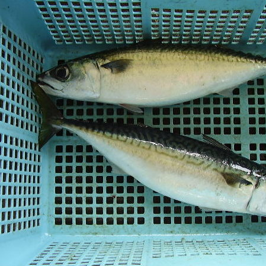

   ※写真はイメージです

Image
-----

.. class:: center

*  Server + Deps =
   Container

----

:id: goals

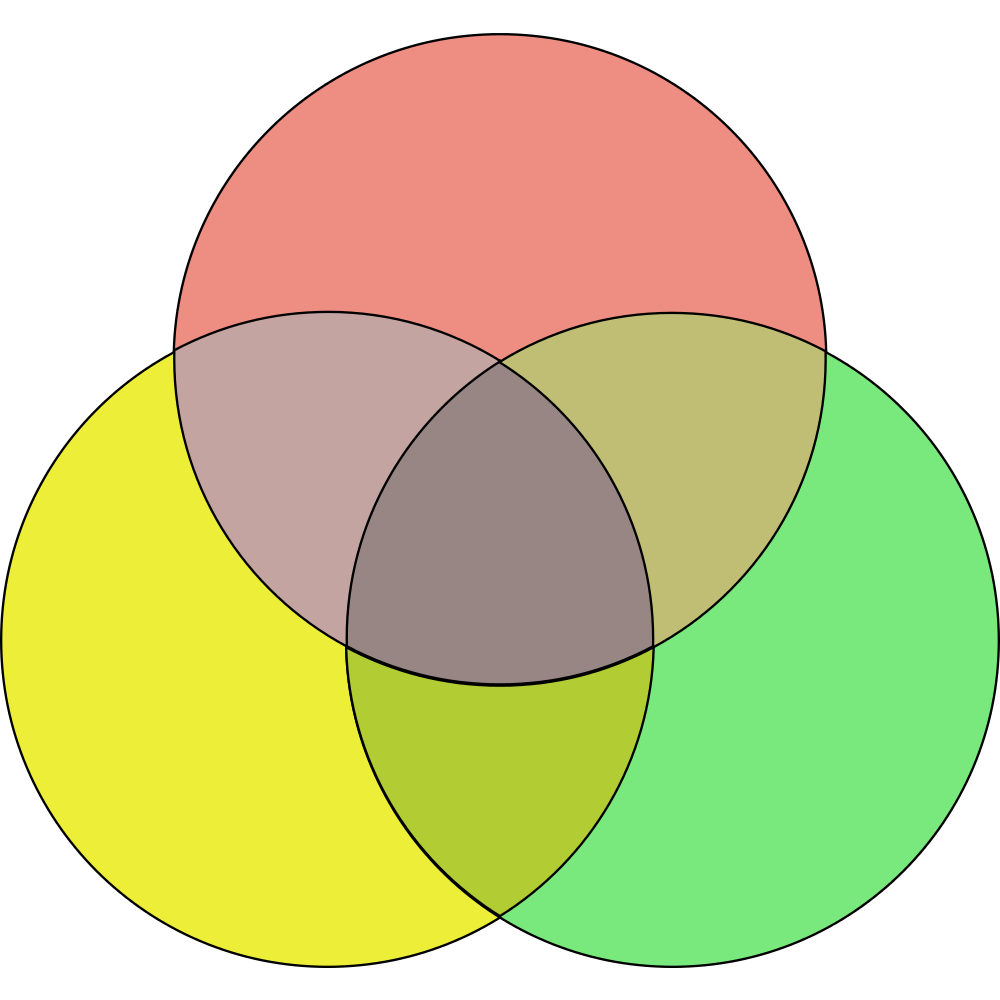

   ※写真はイメージです

Goals
-----

* Fast
* Small
* Correct

----

:id: fast

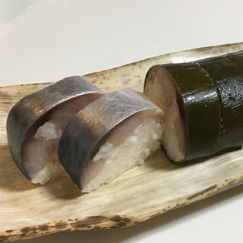

   ※写真はイメージです

Fast
----

* Fast build
* Fast pull

----

:id: small

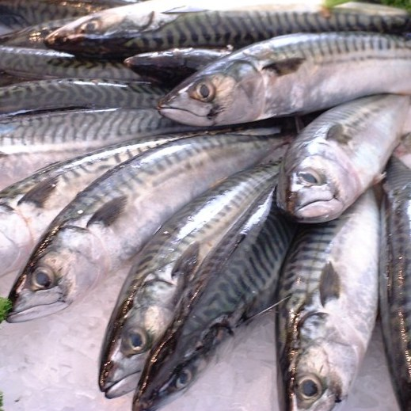

   ※写真はイメージです

Small
-----

* Many servers
* Fast pull

----

:id: correct

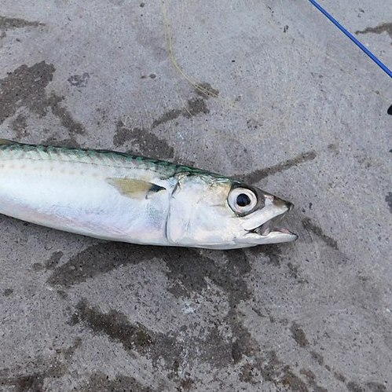

   ※写真はイメージです

Correct
-------

* Successful build
* Reproducible build

----

:id: dockerfile

.. code:: dockerfile

   FROM golang:1.13

   RUN mkdir /src/
   WORKDIR /src/
   COPY go.mod go.sum hello-world.go ./
   RUN go build hello-world.go
   CMD ["/src/hello-world"]

----

:id: alpine

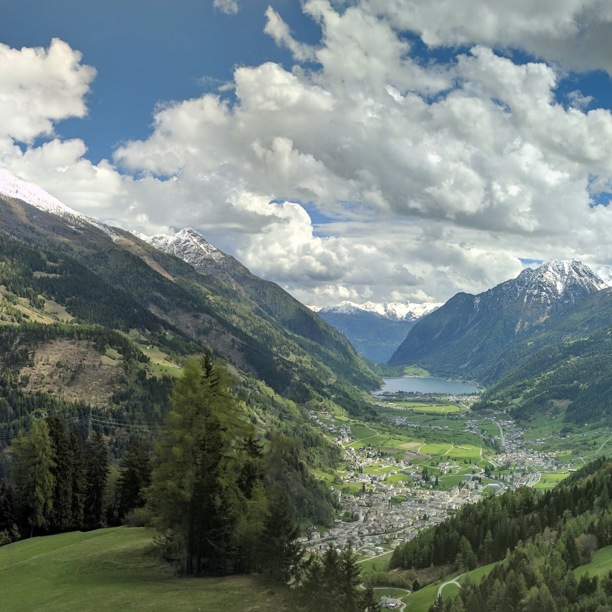

   ※写真はイメージです

Base Image
==========

*  ``golang:1.13`` (Debian)
*  ``golang:1.13-alpine``
*  823MB → 380MB

----

:id: dockerfile2

.. code:: dockerfile

   FROM golang:1.13-alpine AS builder
   RUN mkdir /src/
   WORKDIR /src/
   COPY go.mod go.sum hello-world.go ./
   RUN go build hello-world.go

   FROM alpine
   COPY --from=builder /src/hello-world /bin/
   CMD ["/bin/hello-world"]

----

:id: 2-stage

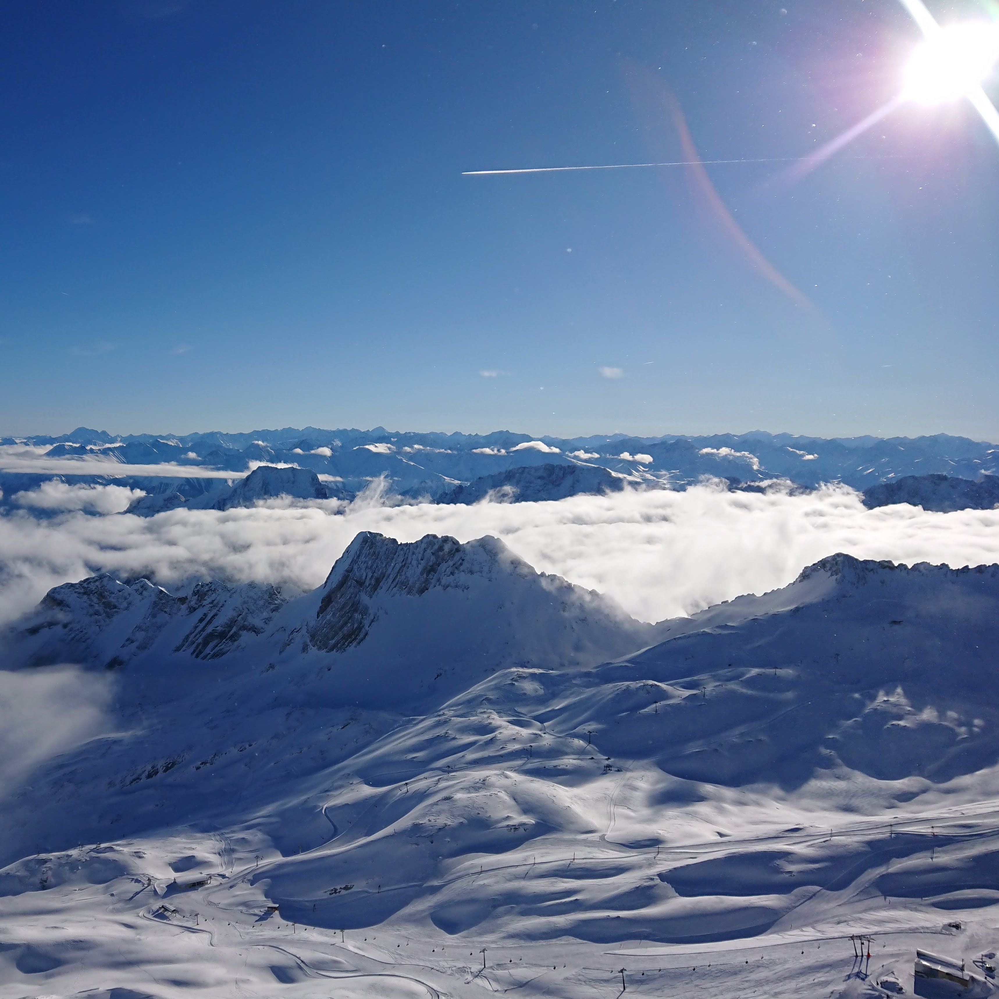

   ※写真はイメージです

2-stage
-------

====== ====== ======
Image  Debian Alpine
====== ====== ======
1stage 823MB  380MB
2stage 122MB  13.5MB
====== ====== ======

----

:id: base-size

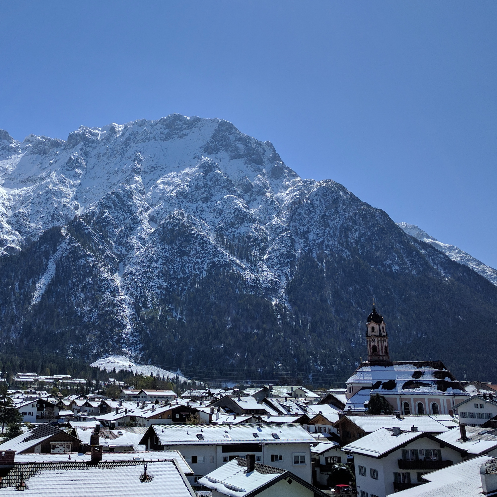

   ※写真はイメージです

Base Size
---------

====== ====== ======
Image  Debian Alpine
====== ====== ======
1stage 823MB  380MB
2stage 122MB  13.5MB
------ ------ ------
golang 803MB  359MB
base   114MB  5.58MB
====== ====== ======

----

:id: heavy

   ※写真はイメージです

Heavy
-----

* alpine: 5.6MB
* binary: 7.6MB
* debian: 114MB

----

:id: minideb

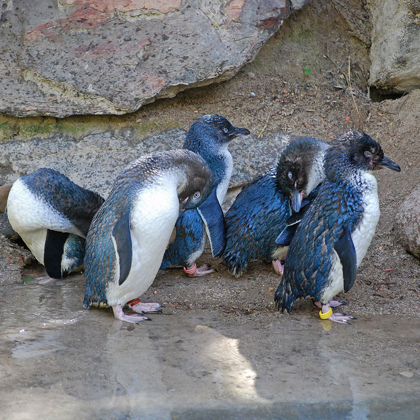

   ※写真はイメージです

Minideb
-------

* alpine: 5.6MB
* binary: 7.6MB
* minideb: 67.5MB
* debian: 114MB

----

:id: python

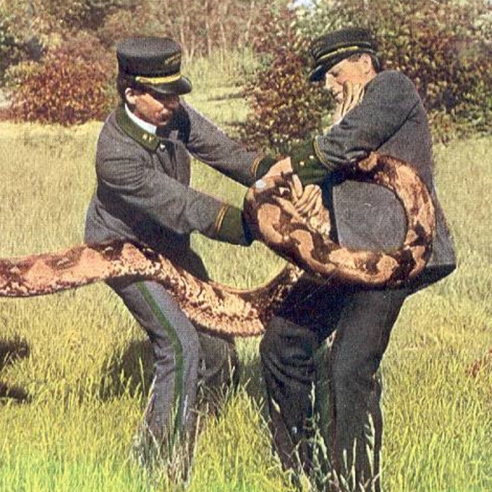

   ※写真はイメージです

Python
------

====== ====== ======
Image  Debian Alpine
====== ====== ======
base   114MB  5.58MB
golang 803MB  359MB
python 918MB  98.7MB
final  927MB  109MB
====== ====== ======

----

:id: download

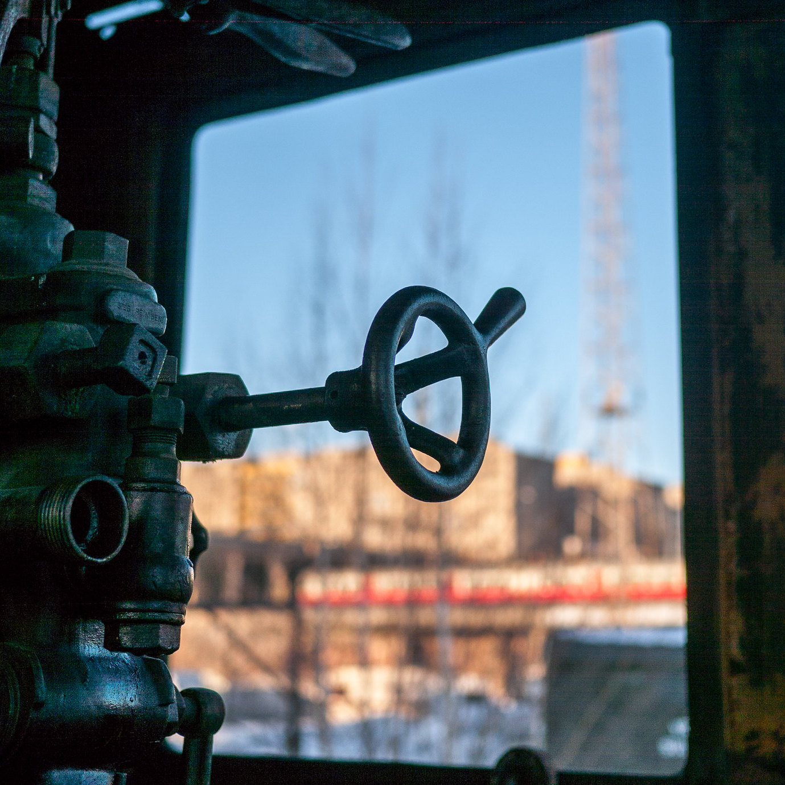

   ※写真はイメージです

Download
--------

*  alpine: 5s (5.6MB)
*  debian: 8s (114MB)
*  golang: 20s (803MB)

.. 5.050, 4.968, 5.025
   7.782, 7.960, 8.256
   19.757, 20.621, 20.138

----

:id: dockerfile3

.. code:: dockerfile

   FROM golang:1.13-alpine AS builder

   RUN mkdir /src/
   WORKDIR /src/
   COPY go.mod go.sum ./
   RUN go mod download

   COPY hello-world.go ./
   RUN go build hello-world.go

----

:id: rebuild

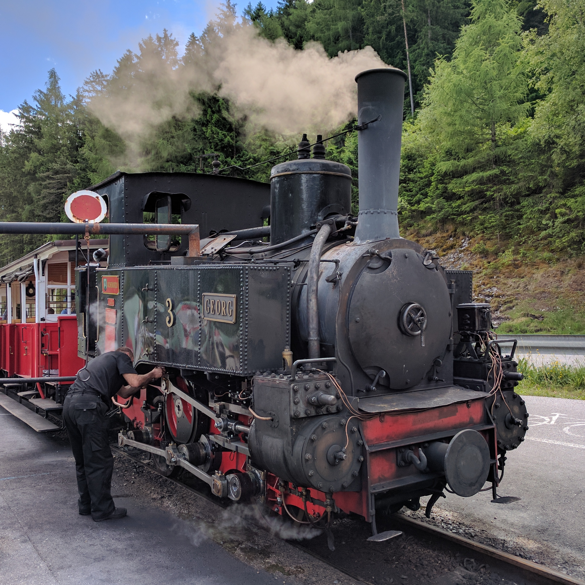

   ※写真はイメージです

Rebuild
-------

*  together: 26s → 5.5s
*  separate: 27s → 4.5s

.. 25.82 → 5.38
   25.21 → 5.55
   26.32 → 5.53

   27.44 → 4.50
   26.22 → 4.56
   27.48 → 4.59

----

.. figure:: img/box.jpg
   :target: https://commons.wikimedia.org/wiki/File:Cardboard_Boxes_and_their_History.jpg

   ※写真はイメージです

:id: package

Package
-------

*  go.mod, go.sum
*  Pipfile, requirements.txt
*  package.json
*  Gemfile

----

:id: dockerignore

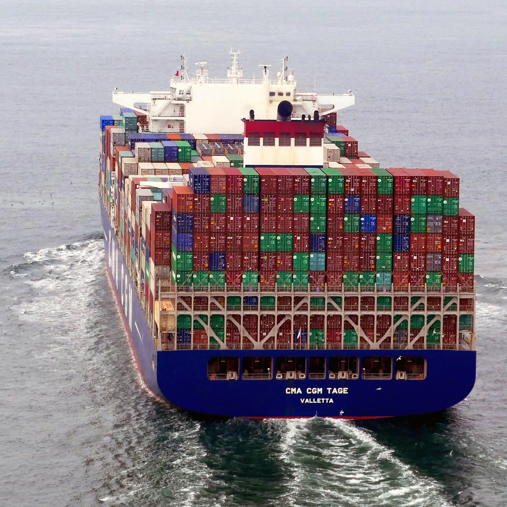

   ※写真はイメージです

Ignore
------

*  ``Dockerfile``:

   .. code:: dockerfile

      COPY ./ ./

*  ``.dockerignore``:

   .. code:: dockerfile

      Dockerfile

----

:id: csaas

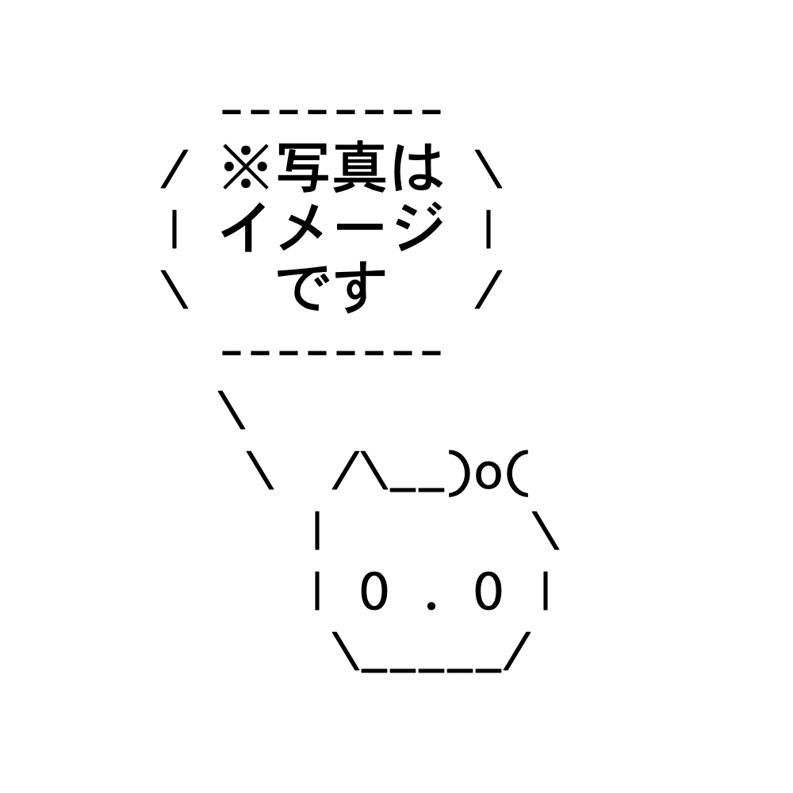

   ※写真はイメージです

Cowsay As A Service (CSaaS)
---------------------------

.. code:: sh

   $ cowsay \
     -fhellokitty \
     ※写真はイメージです

----

:id: csaas-bad

.. code:: dockerfile

   FROM debian
   COPY --from=builder /src/csaas /bin/
   RUN apt-get update
   RUN apt-get install -y cowsay
   RUN rm -rf /var/lib/apt/lists/*
   ENV PATH=/usr/games:/usr/bin:/bin
   CMD ["/bin/csaas"]

----

:id: csaas-good

.. code:: dockerfile

   FROM debian
   RUN apt-get update \
    && apt-get install -y cowsay \
    && rm -rf /var/lib/apt/lists/*
   COPY --from=builder /src/csaas /bin/
   ENV PATH=/usr/games:/usr/bin:/bin
   CMD ["/bin/csaas"]

----

:id: csaas-size

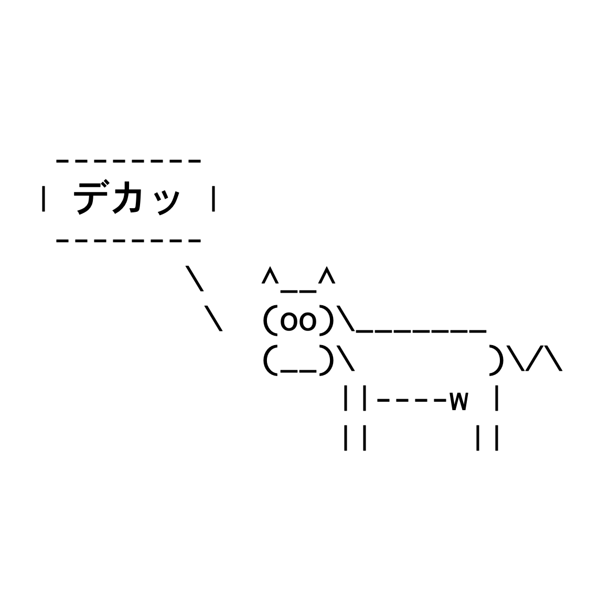

   ※写真はイメージです

CSaaS Size
----------

====== ======
Using  Size
====== ======
RUN    186MB
&&     169MB
====== ======

----

:id: csaas-speed

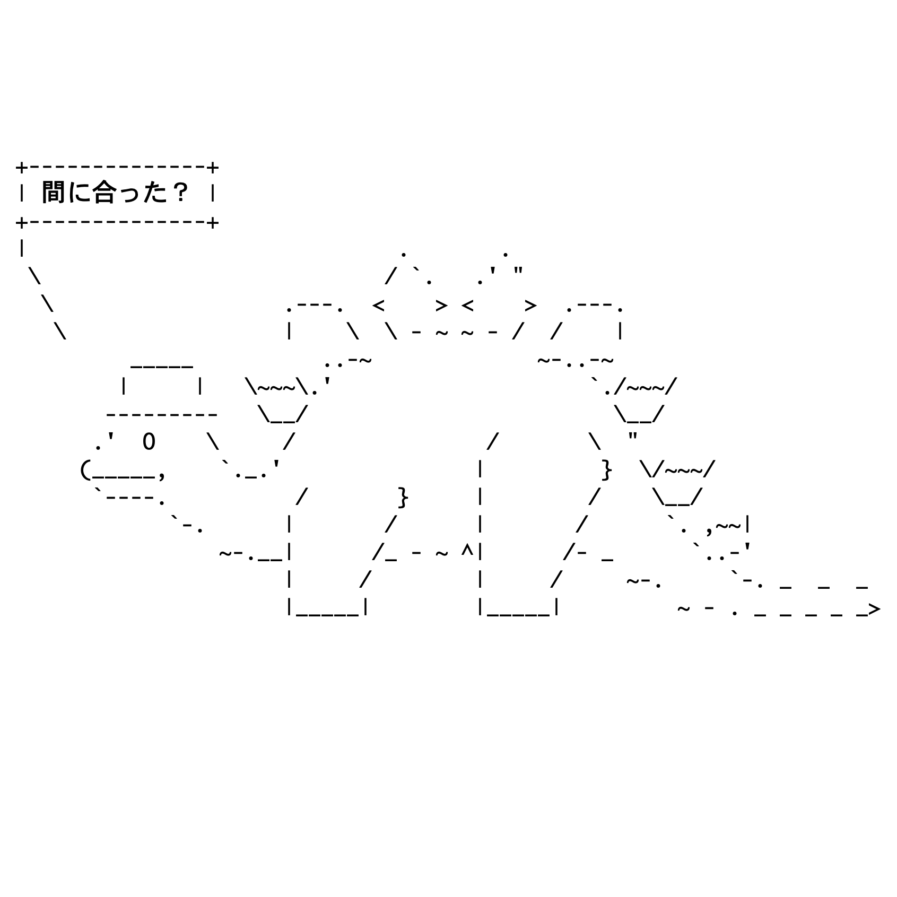

   ※写真はイメージです

CSaaS Speed
-----------

====== ====== =======
First  build  rebuild
====== ====== =======
copy   26s    26s
apt    13s    4.5s
====== ====== =======

.. 25.74 → 11.44
   26.45 → 14.93
   23.80 → 11.93

   23.54 → 4.54
   29.45 → 4.45
   23.77 → 4.39

----

:id: hub

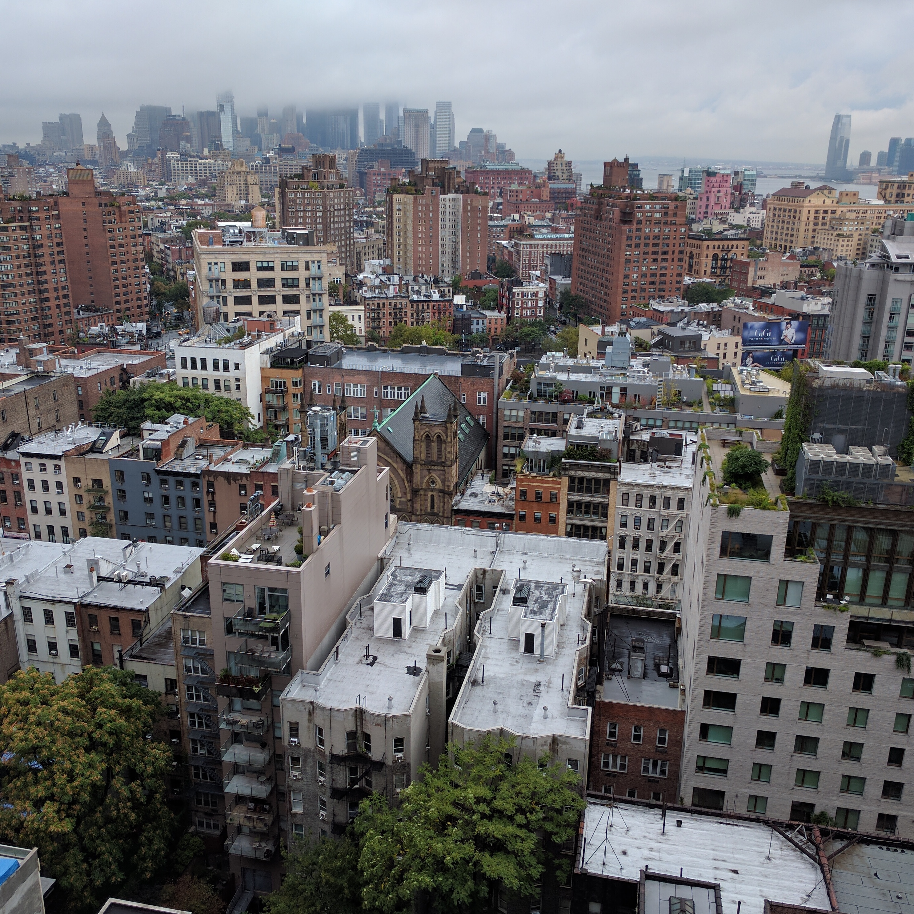

   ※写真はイメージです

Docker Hub
----------

*  AWS US-East
*  sfiera/dev (398MB)
*  Pull: 14s

.. 13.908s
   14.274s
   14.265s

----

:id: harbor

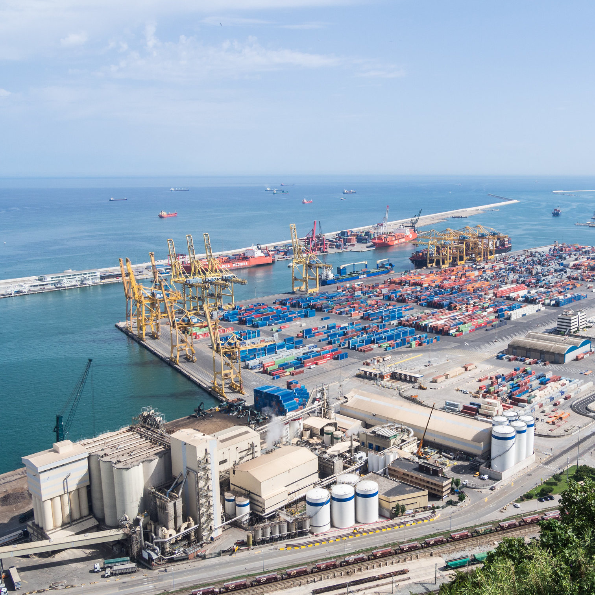

   ※写真はイメージです

LINE Harbor
-----------

*  Pull: 14s → 14s

.. 15.172s
   11.634s
   13.235s

----

:id: registry

   ※写真はイメージです

Localhost
---------

.. code:: sh

   $ docker run \
     -p 5000:5000 \
     registry

*  14s → 7s

.. 6.757s
   6.897s
   7.417s

----

:id: extract

.. code::

   $ docker pull sfiera/dev
   Using default tag: latest
   latest: Pulling from sfiera/dev
   34dce65423d3: Extracting   23.3MB/27.62MB
   796769e96d24: Download complete
   2a0eada9611d: Download complete
   d6830a7cd972: Download complete
   0eb560759b5f: Downloading  23.02MB/102.1MB
   d7bd1b4be5fc: Waiting
   0508d0ce771e: Waiting

----

:id: fin

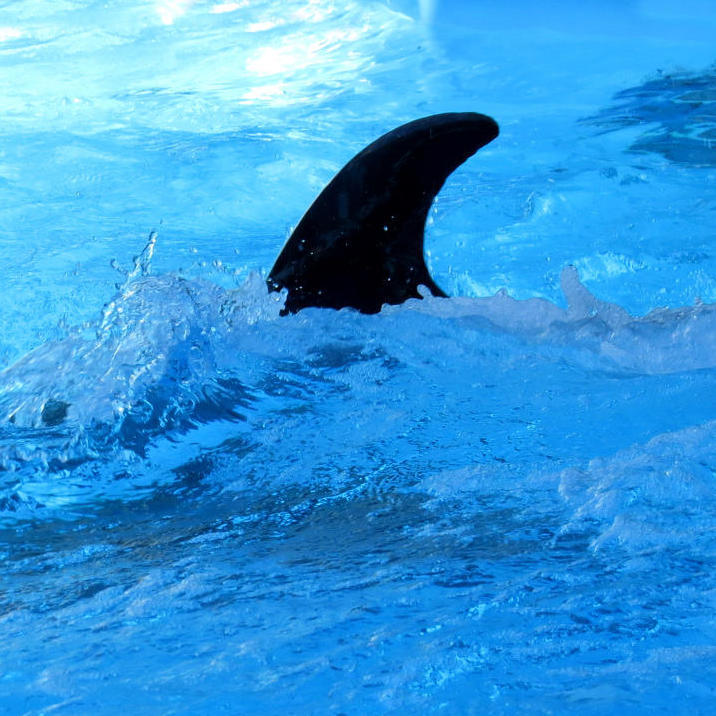

   ※写真はイメージです

fin
---

.. note:: intentionally blank

----

:id: blank

.. note:: intentionally blank
